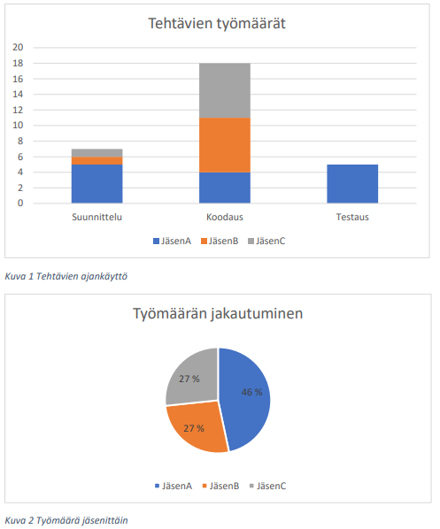

# Sprint 1

## Yleistä

Sprint alkoi xx.x ja päättyi xx.x. 

Sprintin julkaistu versio löytyy osoitteesta [sprint1.tunnus.treok.io](http://sprint1.tunnus.treok.io).

Mikäli ajankäyttöä seurattu Excel-taulukolla kannattaa kuvata se tässä kohdassa.

## Toteutetut user storyt

Sprintin aikana saatiin tehtyä seuraavat user storyt:
- Opiskelija haluaa rekisteröityä järjestelmän käyttäjäksi (Jäsen A)
- Vuokranantaja haluaa rekisteröityä järjestelmän käyttäjäksi (Jäsen A)
- Opiskelija tai vuokranantaja haluaa kirjautua järjestelmään (Jäsen B)
- jne.

## Retrospektiivi

Pohtikaa ryhmässä miten sprint onnistui
- Miten työjako sujui ryhmässänne?
- Missä tunsitte onnistuneenne?
- Onko jotain mitä voidaan tehdä paremmin seuraavalla kerralla?