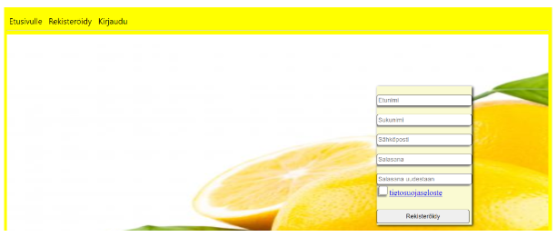
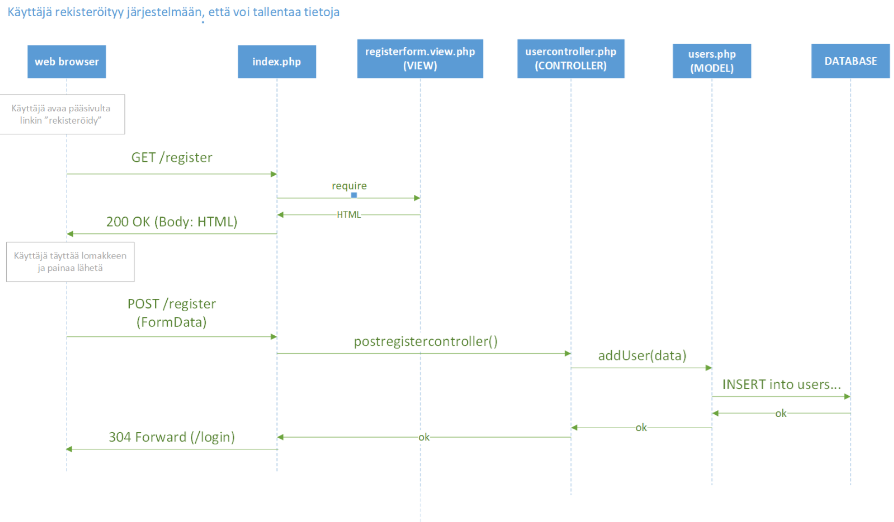
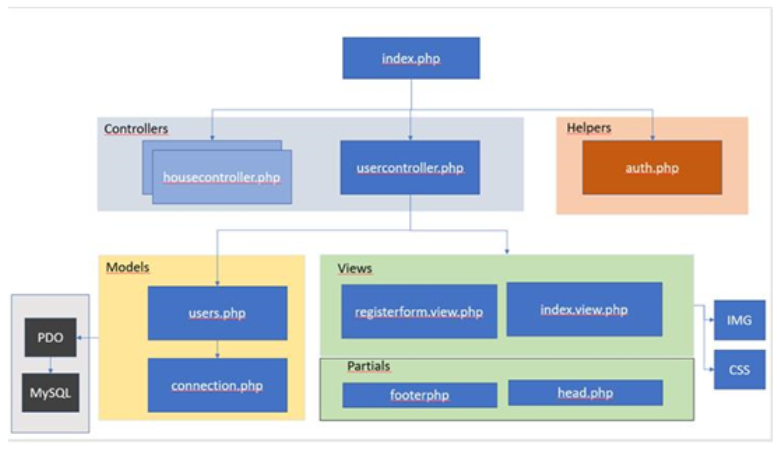

# Koodidokumentti

## Yleistä
Koodidokumentti kuvaa yhden user storyn toteutuksen. Projektin päätteeksi tehdään koodidokumentti jossa esitetään valitun itse toteutetun user storyn toiminta (frontend ja backend).

## Kuvaus
Kuvaa user storyn toiminta. Liitä esimerkiksi projektiseinältä kuva tehtävästä tai kerro sanallisesti mitä toiminnallisuus mahdollistaa käyttäjälle.

Lisää kuva käyttöliittymästä.

## Sekvenssikaavio
Laadi sekvenssikaavio jossa kuvaat user storyn toiminnan.

## Arkkitehtuurikaavio
Laadi arkkitehtuurikaavio projektin koodista. Piirrä kuvaan päätaso sekä valitsemaasi user storyyn liittyvät komponentit.

## Koodin kommentointi
Lisää englanniksi kommentit user storyyn liittyviin kooditiedostoihin. Voit tehdä oman branchin johon lisäät kommentoidut tiedostot, näiden ei tarvitse olla välttämättä main-haarassa.

Tiedoston alkuun kommenttilohko:

    /**
    * userManagement.php
    * Controller for user functionalities
    */

Funktion alkuun kommenttilohko:

    /**
    * registerController()
    * Handles registration. Forwards user
    * to login-page or back to register-page
    * in case of an error.
    */

## Testaus
Liitä tähän user storyyn liittyvät systeemitestauksen testitapaukset MS Excel-taulukostanne mukaan dokumenttiin.

## Itsearviointi
Kirjoita itsearviointi tutkinnon osan ammattitaitovaatimuksista. Mieti myös minkä arvosanan antaisit itsellesi tutkinnon osan kriteereihin perustuen.

[ePerusteet: Ohjelmointi 45 osp](https://eperusteet.opintopolku.fi/#/fi/ammatillinen/6779583/tutkinnonosat/6810819)
